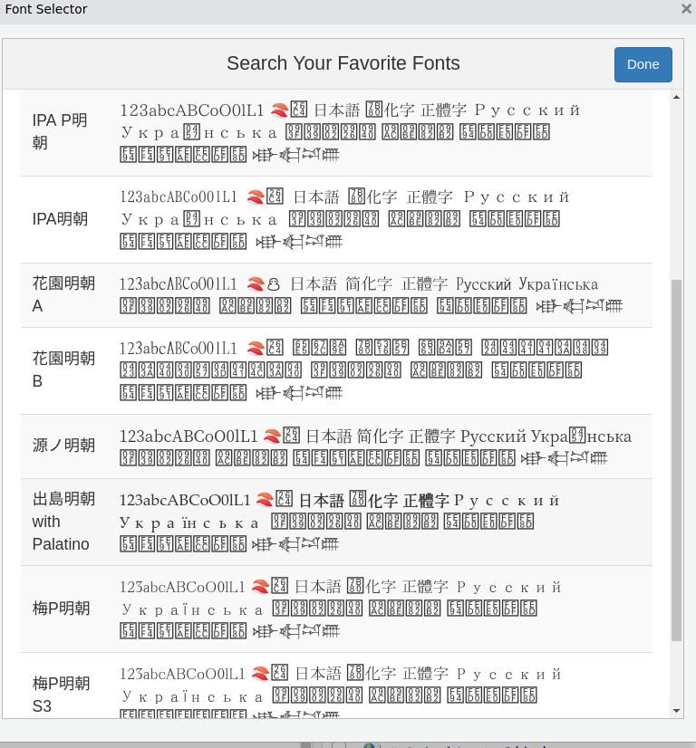
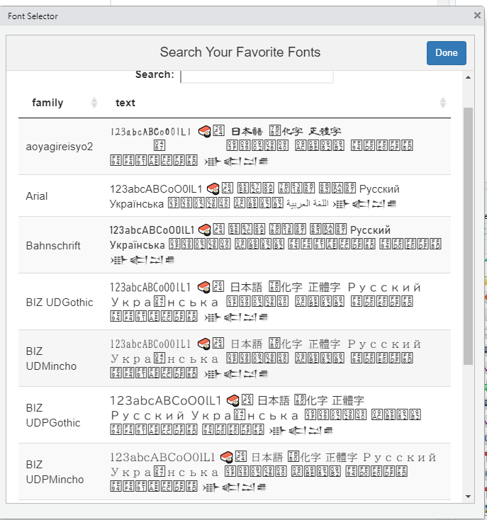

# Cross-platform Automatic Font Registerer For R Graphics

全てのシステムフォントをRグラフィックスに登録するだけのパッケージ
(クロスプラットフォーム)

**お使いのOSがLINUXの場合は不要です**

**You don’t have to use this package if your operating system is LINUX**

## Installation

run the following command in R

``` r
remotes::install_github("Gedevan-Aleksizde/fontregisterer", upgrade = "never")
```

This package depends on
[`systemfonts`](https://cran.r-project.org/web/packages/systemfonts/index.html).

## Usage

This package registers all of your system fonts automatically when
loaded. this procedure is executed by `widowsFonts()` (when Windows OS)
or `quartzFonts()` (when Mac OS).

``` r
library(fontregisterer)
```

You can also reload by executing `register_all_fonts()`.

You can check the list of loaded fonts by `windowsFonts()` or
`quartzFonts()`, or `systemfonts::system_fonts()$family` if LINUX.

You can specify font family name to charts drawn by both `graphics` and
`ggplot2` based packages.

ALL YOUR FONT ARE BELONG TO YOU…

## インストール方法

R で以下を実行してください

``` r
remotes::install_github("Gedevan-Aleksizde/fontregisterer", repos = NULL, type = "source")
```

このパッケージは
[`systemfonts`](https://cran.r-project.org/web/packages/systemfonts/index.html)
に依存しています.

## 使い方

``` r
library(fontregisterer)
```

で読み込んだ時点で作動します. Windows なら `windowsFonts()`, Mac なら
`quartzFonts()` を使用してシステムフォントを全て登録します.
やり直したかったら `register_all_fonts()` を実行してください
(例えば使用中に新しくフォントをインストールしたなどの場合).

登録されたフォントファミリを確認したい場合は `windowsFonts()` または
`quartzFonts()` を実行してください. LINUX の場合は
`systemfonts::system_fonts()$family` で確認できます.

登録されたフォントファミリ名は標準グラフィックにも `ggplot2`
にも指定可能です. `png()`, `quartz()`
デバイスでの保存時にも文字化けしません.

例えば, Windows (8以降) ならば `"Yu Mincho"` (游明朝), `Yu Gothic`
(游ゴシック) などを, Mac なら `"Hiragino Mincho ProN"`
(ヒラギノ明朝ProN), `"Hiragino Sans"` (ヒラギノ角ゴシック)
などを指定可能です.

グラフのフォント指定は例えば標準グラフィックスなら

``` r
par(family = "Yu Gothic")
plot(0, 0)
text(0, 0, "日本語表示で広がるRの世界")
```

`ggplot2` なら

``` r
require(ggplot2)
ggplot(data.frame(x = 0), aes(x = 0, y = 0, label = "日本語表示で広がるRの世界")) +
  geom_point(family = "Yu Gothic") +
  labs(x = "X軸ラベル", y = "Y軸ラベル", title = "タイトル") +
  theme(text = element_text(family = "Yu Gothic"))
```

-   v0.3 以降,
    フォントのサンプルを表示するRStudioアドインを追加しています. Addins
    -&gt; “Font Selector” を選択してください.





このパッケージの意義や用途全般の話は詳しくは以下を参考にしてください.

<https://ill-identified.hatenablog.com/entry/2020/10/03/200618>

Japan.R 2020 で紹介しました.

<https://speakerdeck.com/ktgrstsh/display-cjk-font-in-any-gpraphic-device-and-platform-2020>

ALL YOUR FONT ARE BELONG TO YOU…

## 既知の問題

特に Windows OS において,
いくつかのフォント・グラフィックデバイスの組み合わせ時にフォントが認識されないことがあります.
これは主に Windows OS では fontconfig ライブラリが使えず,
**systemfonts** (v1.0.1 現在)
パッケージやグラフィックデバイスでフォント検出の独自実装をせざるを得ないのが原因です.
また本パッケージがなくとも **ragg** でフォント選択はできますが, 同じく
**systemfonts** に依存しているため一部のフォントが使用できません.
依存パッケージの問題のため, **fontregisterer** では解決が難しいです.

例:

1.  BIZ UDフォントシリーズ Windows
    10にプリインストールされているものはウェイトが500のため, Windows
    では標準ウェイトのフォントとしてマッチングできず,
    使用できないことがあります. Linux や Mac
    などではおそらく正常に動作します.
2.  イタリック体を持たないフォント (多くの日本語フォント)
    イタリック体と斜体 (スラント体) は厳密には異なります.
    日本語でイタリック体を指定してもうまく表示されないことが多いです.
3.  フォントファミリ名にスペースを含むもの **svglite**
    でうまくフォント名を認識できないことがあります. SVG
    ファイルはテキスト形式なので手動で引用符で囲むなどして修正することができます.
